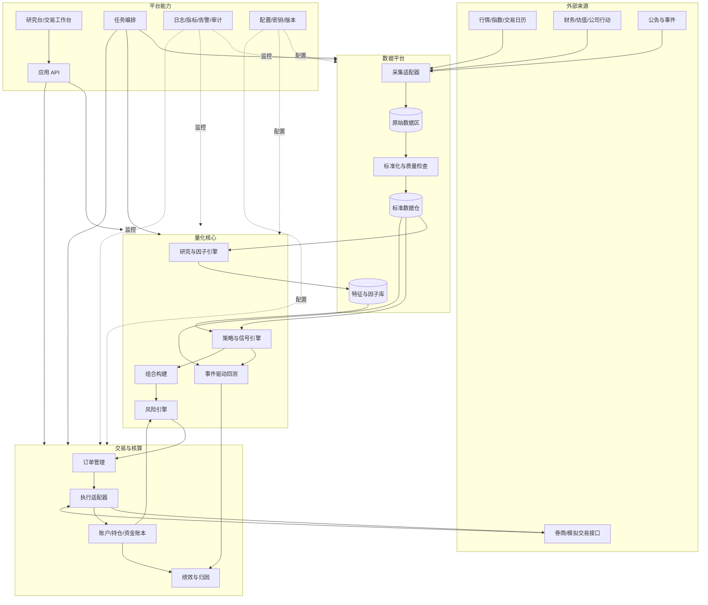
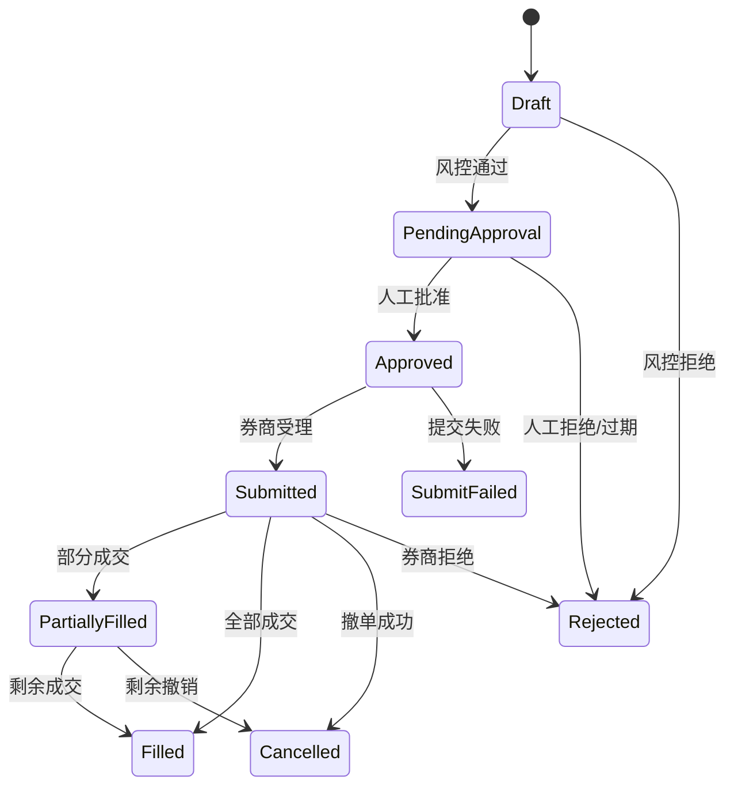

# 量化交易辅助系统总体架构

> 文档状态：Draft v0.1  
> 创建日期：2026-07-21  
> 当前基线：A 股、日频、多因子/规则策略、收盘后计算、人工确认下单  
> 定位：研究与交易决策辅助系统，不承诺收益，也不以首版全自动交易为目标

## 1. 文档目的

本文档定义量化交易辅助系统的业务边界、总体架构、模块职责、核心数据模型、主要流程、风险控制和演进路线。后续每个模块的详细设计、任务拆分和代码实现都应以本文档为上层约束。

当前假设并非最终决定。市场、交易频率、券商、资金规模或自动化程度发生变化时，应通过架构决策记录（ADR）更新，而不是把差异隐含在代码中。

## 2. 产品目标与边界

### 2.1 核心目标

系统应帮助使用者完成以下闭环：

1. 稳定获取、清洗并保存可追溯的市场与基本面数据。
2. 在统一研究环境中开发因子和策略，避免未来数据与幸存者偏差。
3. 使用接近真实市场约束的回测评估策略。
4. 将策略信号转换成满足组合与风险约束的目标仓位。
5. 生成可解释、可审核的交易建议，并由用户确认。
6. 记录订单、成交、持仓、资金和绩效，比较回测、模拟盘与实盘的偏差。
7. 对数据异常、策略异常、风险超限和任务失败进行告警。

### 2.2 首版范围

- 市场：A 股，架构预留港股、美股扩展能力。
- 频率：日频；盘后生成下一交易日建议。
- 策略：规则策略、多因子选股、择时和组合策略。
- 账户：首版单用户、单账户，数据模型支持多账户。
- 执行：人工审核后导出订单或调用券商接口；默认不开启无人值守自动下单。
- 部署：本地或单台服务器运行。
- 数据规模：以全市场日线、财务数据及派生因子为主。

### 2.3 首版明确不做

- 高频或超低延迟交易。
- 依赖逐笔成交和盘口重建的策略。
- 自建完整交易所撮合系统。
- 让大语言模型直接、无约束地决定买卖和仓位。
- 在未经回测、模拟盘和小资金验证前启用自动交易。
- 面向公众提供投资建议或代客理财服务。

## 3. 设计原则

1. **正确性优先于速度**：研究结果可复现、交易规则正确，比过早优化性能更重要。
2. **时间点一致性**：策略在某时刻只能看到该时刻已经公开且可获得的数据。
3. **研究与交易共用核心逻辑**：因子、组合构建、费用和风控规则尽量只实现一次。
4. **原始数据不可变**：原始输入按来源、日期和版本保存，清洗结果可重新生成。
5. **全链路可追溯**：每条信号、建议订单和成交都能追溯到代码、配置和数据版本。
6. **风险规则高于策略信号**：策略提出意图，风控决定是否允许，执行层不能绕过风控。
7. **人工可接管**：任何自动化任务都能暂停；任何订单在执行前都能查看原因和影响。
8. **配置与代码分离**：费用、交易规则、阈值、账户和数据源不得散落硬编码。
9. **先模块化单体，后按压力拆分**：通过清晰边界获得可维护性，不为微服务而微服务。
10. **故障安全**：数据不完整、时间不确定、规则加载失败时，默认不生成或不执行订单。

## 4. 总体架构



### 4.1 推荐部署形态

MVP 采用“模块化单体 + 独立任务进程”：

- 一个 Python 代码库，按领域模块隔离。
- 一个 API/工作台进程服务查询和人工审核。
- 一个或多个任务进程负责数据同步、计算、回测和报表。
- DuckDB + Parquet 负责本地分析数据；需要并发和长期在线服务时引入 PostgreSQL。
- 券商、数据供应商和通知渠道全部通过适配器接入。

只有出现明确需求时才拆服务，例如：分钟级数据吞吐成为瓶颈、多个账户需要独立执行、执行服务需要更严格隔离，或不同模块需要独立扩容。

## 5. 模块职责

### 5.1 数据接入 `data_ingestion`

职责：

- 对接行情、交易日历、证券主数据、指数成分、财务、估值和公司行动数据源。
- 支持全量初始化、按日期增量同步、缺口回补和失败重试。
- 保存供应商原始响应及采集元数据。
- 将供应商字段映射为系统统一模型。
- 对重复请求保持幂等，不因重跑产生重复记录。

边界：数据接入不计算交易信号，也不直接修改策略结果。

### 5.2 数据质量与标准化 `data_quality`

职责：

- 检查主键重复、字段类型、价格关系、负数成交量、日期连续性和缺失值。
- 对比交易日历，识别遗漏、停牌和真正无数据的区别。
- 校验复权因子、拆分、分红、配股等公司行动。
- 输出质量报告和严重级别；严重错误阻断下游任务。
- 维护证券代码、交易所、板块、行业和上市状态的历史变化。

数据修复必须保留原值、修复规则、执行时间和版本，不能静默覆盖原始数据。

### 5.3 特征与因子库 `features`

职责：

- 提供收益率、波动率、成交活跃度、估值、质量、成长、动量等可复用特征。
- 定义特征的观察窗口、可用时间、依赖数据和空值策略。
- 支持截面去极值、标准化、行业/市值中性化。
- 对结果按日期、股票、版本缓存。
- 记录因子覆盖率、分布、相关性、IC/Rank IC 和稳定性。

基本面数据必须以实际披露时间作为可用时间，不能只按财报期结束日连接行情。

### 5.4 策略与信号 `strategy`

职责：

- 将特征和市场状态转换为带方向、强度、置信度和有效期的信号。
- 提供股票池过滤、排序、入选/剔除规则和调仓规则。
- 输出“期望暴露”，不直接创建券商订单。
- 对每条信号保存解释信息，例如使用的因子值、排名和触发条件。

策略接口应保持确定性：相同代码、配置和输入快照必须得到相同结果。

### 5.5 回测引擎 `backtest`

职责：

- 按交易日或事件推进模拟时钟。
- 在正确时间加载当时可见数据并运行策略。
- 模拟订单生成、成交、拒单、部分成交、停牌、涨跌停和 T+1 等约束。
- 模拟佣金、最低佣金、印花税、过户费、滑点和市场冲击。
- 生成订单、成交、持仓、现金、净值、风险和绩效记录。
- 支持基准比较、滚动回测、样本外验证和参数实验。

禁止用当日收盘价产生信号后又假设以同一个收盘价无条件成交。每个策略必须明确：`信号观察时点 -> 订单提交时点 -> 成交价格模型`。

### 5.6 组合构建 `portfolio`

职责：

- 将多个策略信号合成为目标组合。
- 支持等权、分数加权、波动率倒数、风险预算和受约束优化。
- 控制单股、行业、风格、市场和策略暴露。
- 考虑现有持仓、现金、最小交易单位和换手成本。
- 输出目标仓位及从当前仓位到目标仓位的差额。

组合构建只表达“希望持有什么”；能否交易由风险和执行层决定。

### 5.7 风险引擎 `risk`

风险规则分为三类：

- 组合前风险：股票池资格、ST/退市风险、流动性、黑名单、数据新鲜度。
- 下单前风险：资金、可卖数量、T+1、涨跌停、单笔/单股/行业限额、价格偏离、重复订单。
- 交易后风险：实际暴露、回撤、成交偏差、集中度、异常亏损和账户不一致。

每次风险检查输出结构化结果：规则编号、通过/拒绝、实际值、阈值和说明。硬限制只能由显式授权流程覆盖，并必须写入审计记录。

### 5.8 订单管理 `oms`

职责：

- 将通过风控的交易意图转换为订单。
- 管理草稿、待审核、已批准、已提交、部分成交、已成交、已撤销、已拒绝等状态。
- 使用客户端订单号保证提交幂等。
- 处理撤单、重试、超时和券商回报。
- 保存策略目标、风控结果、审核人与真实订单之间的关联。

首版关键控制点是人工审核：用户能看到买卖原因、数量、预计金额、费用、组合变化和风险提示后再批准。

### 5.9 执行适配器 `execution`

职责：

- 提供统一券商接口，隔离不同券商协议差异。
- 查询账户、资金、持仓、订单和成交。
- 提交、撤销和同步订单。
- 将券商状态映射为内部状态，保留原始状态码。
- 支持“模拟执行”“CSV 导出”“真实券商”三种适配器。

执行层不能自行改变策略方向或绕过风控。数量取整、价格保护等执行调整必须记录原因。

### 5.10 账户账本 `ledger`

职责：

- 以成交和资金事件为依据维护现金、持仓、成本和已实现/未实现盈亏。
- 保存每日账户快照，同时保留可重放的事件明细。
- 与券商账户进行日终对账，报告数量、现金、费用和订单差异。
- 为组合、风控和绩效提供统一账户事实。

券商数据是外部事实来源，内部账本是系统行为的可审计记录；二者不一致时不得静默覆盖，应产生对账异常。

### 5.11 绩效与归因 `analytics`

职责：

- 计算收益率、年化收益、波动率、最大回撤、夏普、Sortino、Calmar、换手率和胜率。
- 分解策略、行业、个股、因子和交易成本贡献。
- 比较策略回测、模拟盘、实盘和基准。
- 分析信号衰减、执行滑点、组合偏离和容量。
- 生成日/周/月报告。

### 5.12 应用 API 与工作台 `api` / `ui`

主要页面：

- 数据健康：最新日期、缺失率、异常和任务状态。
- 策略研究：参数、回测、实验比较和因子诊断。
- 每日决策：候选股票、信号解释、目标仓位和风险提示。
- 订单审核：建议订单、批准/拒绝、执行状态和异常处理。
- 账户监控：持仓、现金、收益、回撤、暴露和对账。
- 配置与审计：策略版本、风险阈值、用户操作和系统事件。

API 只负责身份校验、输入验证和业务编排，核心规则保留在领域模块中，避免规则散落在页面或路由里。

### 5.13 任务编排与可观测性 `orchestration` / `observability`

职责：

- 按交易日历运行数据同步、质量检查、因子计算、策略、报表和对账任务。
- 为每次运行分配 `run_id`，记录输入日期、代码版本、配置版本和数据版本。
- 支持依赖、重试、补跑、超时、并发限制和失败通知。
- 采集结构化日志、任务指标、业务指标和审计事件。

关键告警至少包括：数据未更新、数据质量阻断、策略零输出或输出突变、风险超限、订单状态长时间未知、券商连接失败、持仓/现金对账不一致。

## 6. 核心数据模型

| 实体 | 关键字段 | 说明 |
|---|---|---|
| `Instrument` | `instrument_id`, `symbol`, `exchange`, `type`, `list_date`, `delist_date` | 证券主数据，代码不是永久唯一身份 |
| `InstrumentRule` | `instrument_id/market`, `effective_from`, `lot_size`, `price_limit_rule` | 按生效日期管理交易规则 |
| `TradingCalendar` | `exchange`, `trade_date`, `is_open`, `sessions` | 所有调度和回测的时间依据 |
| `Bar` | `instrument_id`, `timestamp`, `open/high/low/close`, `volume`, `amount` | 原始价格与复权价格应区分 |
| `CorporateAction` | `instrument_id`, `action_type`, `announce_date`, `ex_date`, `payload` | 分红、拆并股、配股等 |
| `FundamentalFact` | `instrument_id`, `period_end`, `announce_at`, `field`, `value` | `announce_at` 决定可见性 |
| `FeatureValue` | `as_of`, `instrument_id`, `feature_id`, `value`, `version` | 可复现的特征值 |
| `Signal` | `signal_id`, `as_of`, `strategy_id`, `instrument_id`, `score`, `direction`, `reason` | 策略输出 |
| `TargetPosition` | `run_id`, `account_id`, `instrument_id`, `target_weight`, `target_qty` | 组合期望状态 |
| `OrderIntent` | `intent_id`, `target_id`, `side`, `qty`, `limit`, `risk_result` | 审核前的交易意图 |
| `Order` | `order_id`, `client_order_id`, `broker_order_id`, `status` | 内外订单映射 |
| `Fill` | `fill_id`, `order_id`, `qty`, `price`, `fee`, `filled_at` | 成交事实，必须幂等导入 |
| `PositionEvent` | `account_id`, `event_type`, `instrument_id`, `qty`, `cash`, `occurred_at` | 可重放账本事件 |
| `AccountSnapshot` | `account_id`, `as_of`, `cash`, `market_value`, `nav` | 日终或指定时点快照 |
| `RiskDecision` | `rule_id`, `subject_id`, `decision`, `actual`, `limit`, `reason` | 风控审计结果 |
| `ExperimentRun` | `run_id`, `code_version`, `config_hash`, `data_version`, `metrics` | 研究与回测可复现性 |

通用字段建议包括 `created_at`、`updated_at`、`source`、`source_record_id` 和 `schema_version`。时间统一以带时区时间戳存储，交易日期单独保存；显示层转换为 `Asia/Shanghai`。

## 7. 核心状态与契约

### 7.1 信号到订单的边界

```text
FeatureValue
  -> Signal
  -> TargetPosition
  -> OrderIntent
  -> RiskDecision
  -> Approval
  -> Order
  -> Fill
  -> PositionEvent / AccountSnapshot
```

这些实体不能合并为一张“交易记录”表，因为它们分别代表模型判断、组合决策、用户授权、券商行为和成交事实。

### 7.2 订单状态机



状态更新必须是单向、幂等且可审计的。网络超时只能标记为“状态未知/待查询”，不能直接假设失败后重复下单。

### 7.3 模块接口原则

- 领域模块通过明确的请求/响应对象交互，不直接读取彼此私有表。
- 数据查询必须携带 `as_of` 或数据版本，避免隐式读取“最新数据”。
- 任何产生交易结果的运行都必须携带 `run_id`、`strategy_version`、`config_hash` 和 `data_version`。
- 长任务应通过任务队列/运行记录异步执行，API 返回任务标识。
- 外部接口采用适配器模式，测试时可以替换为录制数据或模拟器。

## 8. 关键业务流程

### 8.1 每日盘后决策流程

```text
交易日历确认收盘
  -> 同步行情/财务/公司行动
  -> 数据质量检查
  -> 生成标准数据快照
  -> 计算增量特征和因子
  -> 运行策略并生成信号
  -> 构建目标组合
  -> 读取实际账户并生成差额订单
  -> 下单前风险检查
  -> 生成决策报告和待审核订单
  -> 用户审核
  -> 下一交易时段执行或导出
```

任一上游阻断级检查失败时，下游交易任务不得继续；研究报表可以带“数据不完整”标记单独运行。

### 8.2 回测流程

```text
冻结实验配置和数据版本
  -> 确定股票池与交易日历
  -> 按模拟时钟逐期加载当时可见数据
  -> 生成信号、目标仓位和订单
  -> 模拟撮合、费用和市场约束
  -> 更新账本与风险状态
  -> 输出结果、诊断和实验清单
```

一次合法回测应能够回答：使用了什么数据、哪些证券、哪个代码版本、哪些参数、何时产生信号、假设何时成交，以及成本如何计算。

### 8.3 实盘对账流程

```text
拉取券商订单/成交/持仓/资金
  -> 按外部唯一键幂等导入
  -> 重放或更新内部账本
  -> 比较内部与券商快照
  -> 自动解释可接受差异
  -> 产生未解释差异告警
  -> 人工确认修复动作
```

## 9. A 股市场规则建模

以下规则应按市场、板块、证券和生效日期配置，不能写成永久常量：

- 交易日、交易时段和集合竞价时段。
- 证券最小交易单位和可卖数量规则。
- T+1 等可用数量限制。
- 普通、ST、上市初期及不同板块的价格限制规则。
- 停牌、退市整理、风险警示和特殊交易状态。
- 佣金、最低收费、印花税、过户费和其他费用。
- 除权除息、现金分红、送转、配股等对价格、现金和持仓的影响。

回测必须使用规则在历史时点的版本，而不是用当前规则回放全部历史。

## 10. 数据存储设计

### 10.1 分层

| 层级 | 推荐介质 | 内容 | 特性 |
|---|---|---|---|
| Raw | 压缩 JSON/CSV/Parquet | 供应商原始响应 | 不可变、按来源和日期分区 |
| Canonical | Parquet + DuckDB | 标准行情、财务、主数据 | 面向批量分析、可版本化 |
| Feature | Parquet + DuckDB | 特征、因子、标签 | 按日期/特征分区、可重算 |
| Operational | PostgreSQL；MVP 可先 SQLite | 任务、配置、订单、审核、账本、审计 | 事务、一致性、并发查询 |
| Artifact | 文件存储 | 回测报告、图表、模型和配置快照 | 通过 `run_id` 关联 |

### 10.2 数据版本

- 原始数据使用内容摘要或供应商批次号标识。
- 标准数据版本由原始版本、清洗代码版本和配置共同决定。
- 特征版本由定义、依赖和计算代码决定。
- 回测和交易运行保存所用版本，不仅保存“最新值”。
- 更正历史数据后产生新版本，旧实验仍能重现。

### 10.3 保留与备份

- 原始数据、成交、账本和审计日志长期保留。
- 可重新计算的中间特征可按策略清理，但必须保留定义和版本信息。
- 数据库和配置定期备份，并进行恢复演练。
- 敏感导出文件应加密或限制访问，不写入代码仓库。

## 11. 风控基线

首版至少支持以下可配置限制：

| 类别 | 示例规则 |
|---|---|
| 数据 | 行情不是最新交易日时禁止生成实盘订单 |
| 标的 | 排除 ST、停牌、退市风险、上市不足 N 日和黑名单证券 |
| 流动性 | 过去 N 日成交额、成交天数和预计参与率下限/上限 |
| 仓位 | 单股、行业、策略、总权益仓位和现金缓冲限制 |
| 交易 | 单笔金额、每日成交金额、换手率、价格偏离和重复订单限制 |
| 账户 | 可用现金、可卖数量、融资/杠杆限制 |
| 亏损 | 日亏损、策略回撤、账户最大回撤触发降仓或暂停 |
| 运行 | 代码/配置未经批准、对账失败或关键告警未解除时禁止下单 |

“止损”只是风险工具之一，不能替代仓位、分散、流动性和策略失效管理。

## 12. 回测与研究质量标准

### 12.1 必须防范的偏差

- 未来数据：使用尚未披露的财务数据或当日尚未形成的价格。
- 幸存者偏差：只用当前仍上市的股票或当前指数成分。
- 复权错误：混用原始价、前复权价和后复权价计算成交与收益。
- 选择偏差：反复试验后只展示最好结果。
- 成本低估：忽略最低佣金、冲击、涨跌停无法成交或成交量限制。
- 参数过拟合：参数对小幅变动极度敏感，样本外表现崩溃。

### 12.2 验证方式

- 明确训练、验证和完全隔离的样本外区间。
- 使用滚动或扩展窗口验证。
- 对交易成本、成交延迟和滑点进行压力测试。
- 检查不同市场阶段、行业和市值区间表现。
- 报告参数敏感性、策略容量和最差阶段，而不只报告平均收益。
- 模拟盘运行足够时间后，再以可承受损失的小资金验证。

## 13. 安全、权限与审计

- 券商密钥、数据源令牌放入密钥存储或环境变量，不写入代码和日志。
- 研究、审核、执行和管理员权限分离；单用户 MVP 也保留角色边界。
- 真实下单默认关闭，通过环境和账户级开关显式启用。
- 关键操作需要二次确认，并记录操作者、时间、修改前后内容和原因。
- API 使用身份认证、最小权限、速率限制和输入校验。
- 日志脱敏账户、令牌、身份证明和其他敏感信息。
- 测试、模拟和生产环境使用不同账户及配置，界面明显标识当前环境。

## 14. 可观测性与运行指标

### 14.1 技术指标

- 任务成功率、运行时长、重试次数和积压。
- API 延迟、错误率和数据库连接状态。
- 数据最新时间、数据量、缺失率和异常率。
- 券商连接状态、请求错误和订单同步延迟。

### 14.2 业务指标

- 信号数量及相对历史均值的偏离。
- 目标与实际仓位偏差。
- 订单拒绝率、撤单率、成交率和平均滑点。
- 组合暴露、换手、费用、收益和回撤。
- 回测、模拟和实盘之间的表现差异。

告警必须附带 `run_id`、账户、策略、交易日、影响范围和建议动作，避免只有一条无法定位的错误文本。

## 15. 技术选型建议

首版候选技术栈：

| 领域 | 推荐 | 说明 |
|---|---|---|
| 语言 | Python 3.12+ | 数据研究和券商生态成熟 |
| 数据处理 | Polars 为主，Pandas 兼容 | Polars 适合批量列式计算 |
| 分析存储 | Parquet + DuckDB | 本地高效、部署简单 |
| 事务存储 | SQLite 起步，PostgreSQL 演进 | 订单/账本进入实盘前建议 PostgreSQL |
| 数据模型 | Pydantic | 统一边界校验与序列化 |
| API | FastAPI | 提供类型化内部接口 |
| 工作台 | Streamlit 起步 | 快速交付研究和审核界面；复杂后再换前端 |
| 任务编排 | CLI + 调度器起步，后续可用 Prefect | 先保持任务可独立、可重跑 |
| 测试 | pytest + Hypothesis | 单元、集成、性质和回归测试 |
| 图表/报告 | Plotly + Markdown/HTML | 可交互分析及归档报告 |

具体库应在模块详细设计时通过小型技术验证确定。核心领域模型不能绑定某个回测框架、数据供应商或券商 SDK。

## 16. 建议代码仓库结构

```text
quant-system/
├─ pyproject.toml
├─ README.md
├─ ARCHITECTURE.md
├─ configs/
│  ├─ environments/
│  ├─ strategies/
│  └─ risk/
├─ data/                    # 默认不提交实际数据
│  ├─ raw/
│  ├─ canonical/
│  └─ features/
├─ src/quant_system/
│  ├─ domain/              # 公共领域实体、值对象和规则
│  ├─ data_ingestion/
│  ├─ data_quality/
│  ├─ features/
│  ├─ strategy/
│  ├─ portfolio/
│  ├─ risk/
│  ├─ backtest/
│  ├─ oms/
│  ├─ execution/
│  ├─ ledger/
│  ├─ analytics/
│  ├─ orchestration/
│  ├─ api/
│  └─ ui/
├─ tests/
│  ├─ unit/
│  ├─ integration/
│  ├─ regression/
│  └─ fixtures/
├─ notebooks/              # 探索用途，不承载生产规则
├─ scripts/
└─ artifacts/              # 本地实验产物，默认不提交
```

生产逻辑必须从 Notebook 提取到 `src` 并接受自动测试；Notebook 只用于探索和展示。

## 17. 测试策略

### 17.1 单元测试

- 复权、收益率、因子和费用公式。
- 仓位取整、T+1、价格限制和风险规则。
- 订单状态转换、幂等键和账本分录。
- 日历边界、上市/退市和公司行动。

### 17.2 集成测试

- 数据源响应到标准表的完整链路。
- 信号到目标仓位、风险检查和订单草稿。
- 模拟券商提交、部分成交、撤单和对账。
- 数据库事务和任务失败恢复。

### 17.3 回归与性质测试

- 固定小型数据集产生固定净值、订单和成交结果。
- 现金、持仓市值和净值满足会计恒等关系。
- 成交数量不超过有效订单数量。
- 同一成交重复导入不改变账户结果。
- 增加正费用不应提高其他条件相同的净收益。
- 未来数据被加入数据仓后，历史时点计算结果不得改变，除非显式切换数据版本。

## 18. 非功能需求

首版建议目标：

- 可复现：任一已归档回测能通过其运行清单重建。
- 可恢复：任务中断后可从明确检查点重跑，不重复下单或记账。
- 可审计：所有订单和人工决策存在完整来源链。
- 可用性：盘后任务失败能在预定决策时间前告警并允许补跑。
- 性能：全 A 股日频增量特征和单策略盘后运行在普通工作站可接受时间内完成；具体阈值在数据源确定后测量。
- 可维护：领域模块无循环依赖，外部供应商通过接口替换。
- 可移植：核心计算可在 Windows 本地开发，并能迁移至 Linux 服务器运行。

## 19. 分阶段实施路线

### 阶段 0：需求与规则冻结

产物：市场、频率、数据源、策略类别、券商、成本模型、风险阈值和验收指标。

完成标准：关键假设均有明确选择，建立第一批 ADR。

### 阶段 1：数据底座

产物：交易日历、证券主数据、日线行情、复权/公司行动、质量报告和数据版本。

完成标准：选定历史区间可以稳定全量导入、增量更新、检测缺口并重建。

### 阶段 2：可验证回测

产物：模拟时钟、基础策略、成交/费用模型、账本、净值和绩效报告。

完成标准：固定数据集回归测试稳定，无已知未来数据问题，会计关系正确。

### 阶段 3：因子与组合

产物：因子库、股票池、多因子策略、组合约束、风险报告和实验管理。

完成标准：完成样本外与压力测试，结果可解释、可复现。

### 阶段 4：每日决策辅助

产物：盘后自动任务、交易建议、审核工作台、CSV/模拟执行和通知。

完成标准：连续运行多个交易日，数据和任务异常不会生成错误订单。

### 阶段 5：模拟盘与实盘对账

产物：券商只读同步、模拟订单、账本、持仓资金对账和实盘偏差分析。

完成标准：订单状态与账户事实稳定同步，所有差异可解释或可告警。

### 阶段 6：受控实盘

产物：人工批准后真实下单、小资金限额、熔断、应急操作手册和恢复演练。

完成标准：在预设观察期内满足运行、风控和对账要求，再评估是否提高自动化程度。

## 20. 首批架构决策记录（ADR）

建议接下来逐项确认：

1. `ADR-001`：首个目标市场及证券范围。
2. `ADR-002`：日频信号的观察时点和成交假设。
3. `ADR-003`：首选数据供应商及替代供应商。
4. `ADR-004`：复权、公司行动和财务数据的时间点规则。
5. `ADR-005`：MVP 存储采用 DuckDB/Parquet + SQLite，何时切换 PostgreSQL。
6. `ADR-006`：首个策略、基准和样本外验证方案。
7. `ADR-007`：账户规模对应的仓位、流动性和回撤限制。
8. `ADR-008`：券商接入方式，以及人工审核与执行边界。

每份 ADR 应包含：背景、候选方案、决定、理由、风险、影响和复审条件。

## 21. 下一步建议

按依赖关系，下一份详细设计应是“数据底座设计”，内容包括：

- 数据源选择与授权限制。
- 证券、交易日历、行情、复权、财务和公司行动的数据字典。
- `as_of` 时间点规则和历史版本方案。
- Raw/Canonical 数据目录与分区。
- 增量同步、质量检查、重试和补数流程。
- 一套能覆盖约 20 只股票、多个特殊交易日和公司行动的测试数据集。

数据底座确认后，再依次设计回测引擎、策略/因子、组合与风控、交易执行和工作台。这样可以尽早消除对所有后续模块影响最大的时间点和数据正确性风险。

